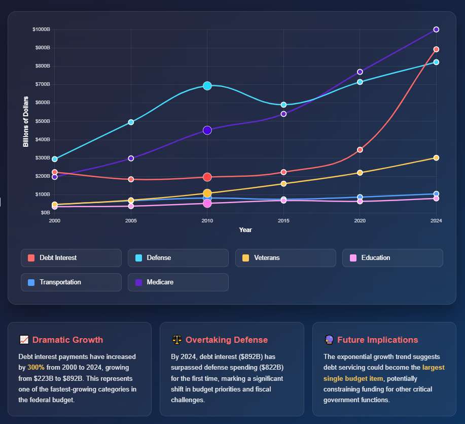

# TEA Space - Advanced Techno-Economic Analysis Platform

  
  
  
  

## 🧭 Why TEA Space?

  

<i>A static snapshot of the motivating signal: interest costs rising faster than future-facing investments.</i>

## 🌟 Overview

TEA Space is a modern environment for techno-economic analysis that turns complex process economics into a structured, defensible narrative. Built on a matrix-native backbone, it treats time and uncertainty as first-class citizens and preserves the provenance of every assumption and change. Analysts move fluidly from scenario design to consolidated results without losing traceability, and teams iterate with shared context and clear accountability. The platform emphasizes clarity, auditability, and extensibility—designed to evolve with emerging environmental metrics and regulatory lenses.

### 🎯 Key Features

#### ✅ Completed

* 🧮 **Core CFA engine** — Base cash-flow analysis across multiple scenarios, consolidating intervalized configurations into a single financial horizon.
* 📊 **Aggregated visualization** — **Dynamic** (interactive dashboards) and **static** (publication-ready) plots across scenarios.
* ⏱️ **Time-scoped parameters** — Control activation windows and levels for precise, temporal scenario design.
* 🧰 **Centralized scaling & factorization** — Apply complex scaling rules to cost components across parameter types and configurations.
* 🔄 **Scenario import/export** — Shareable, versionable bundles with metadata for collaboration.

#### 🛠️ In Progress

* 🧱 **Matrix-based computation layer** — Advanced React state management for determinism, performance, and responsive UX.

#### 🔭 Planned

* 🌱 **Climate Intelligence Layer** — Material-level carbon accounting complementing component-, equipment-, and plant-level series.

## 📄 License

This project is licensed under the MIT License — see the [LICENSE](LICENSE) file for details.

## 🙏 Acknowledgments

* OpenAI for GPT-5 integration capabilities
* React and Python communities
* Contributors to open-source dependencies

## 📞 Contact & Support

* **Email**: [dirbaz.sharif@gmail.com](mailto:dirbaz.sharif@gmail.com)

---

  
Built with ❤️ for sustainable industrial transformation

  
© 2025 TEA Space. Making complex economics simple, sustainable, and intelligent.

