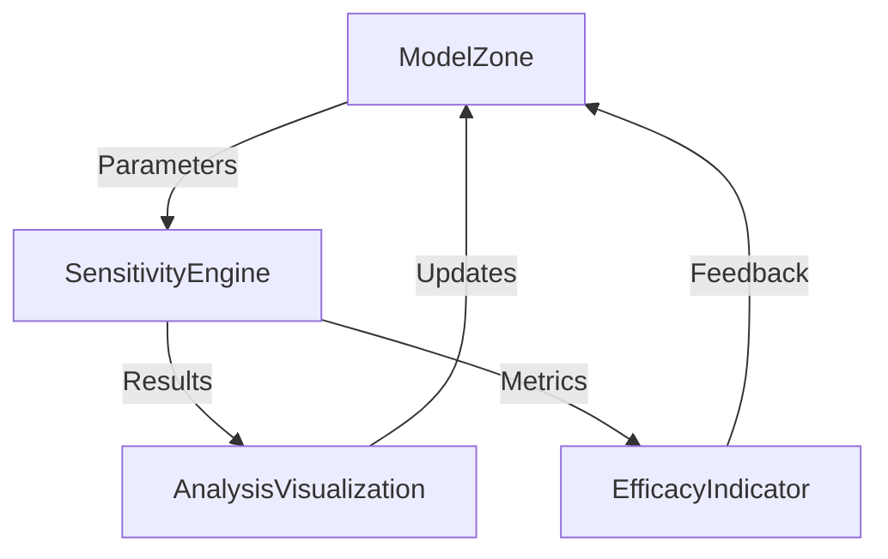
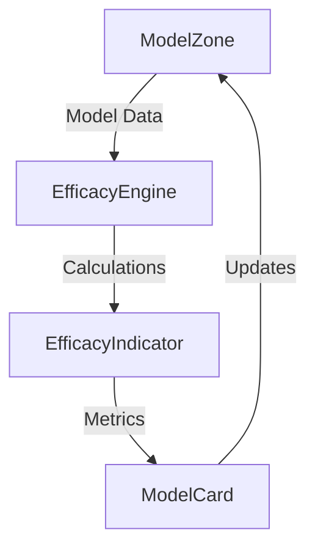

# ModelZone Integration Plan

This document outlines the plan for integrating the ModelZone component with sensitivity analysis and efficacy features.

## Integration Goals

1. **Seamless Data Flow**
   - Connect ModelZone with sensitivity analysis engine
   - Integrate efficacy calculations
   - Establish real-time data synchronization
   - Maintain consistent state across components

2. **User Experience**
   - Provide intuitive navigation between features
   - Ensure responsive feedback during calculations
   - Display clear visualizations of results
   - Support interactive parameter adjustments

3. **Performance**
   - Optimize data processing
   - Implement efficient caching
   - Manage memory usage
   - Handle large datasets effectively

## Component Integration

### 1. ModelZone → Sensitivity Analysis



**Implementation Steps:**
1. Add sensitivity trigger points in ModelZone
2. Set up parameter passing interface
3. Implement results handling
4. Create visualization bindings
5. Add feedback loop mechanisms

### 2. ModelZone → Efficacy Calculation



**Implementation Steps:**
1. Define efficacy calculation triggers
2. Set up data transformation pipeline
3. Implement metric calculations
4. Create update mechanisms
5. Add visualization components

## Data Flow Architecture

### 1. State Management

```typescript
interface ModelZoneState {
  sensitivity: {
    parameters: Parameter[];
    results: AnalysisResult[];
    status: CalculationStatus;
  };
  efficacy: {
    metrics: EfficacyMetrics;
    history: MetricHistory[];
    status: CalculationStatus;
  };
  ui: {
    activeView: ViewType;
    selectedModel: string;
    visualizationConfig: VisualizationConfig;
  };
}
```

### 2. Event System

```typescript
enum ModelZoneEvents {
  SENSITIVITY_START = 'sensitivity:start',
  SENSITIVITY_COMPLETE = 'sensitivity:complete',
  EFFICACY_UPDATE = 'efficacy:update',
  MODEL_CHANGE = 'model:change',
  VISUALIZATION_UPDATE = 'visualization:update'
}
```

## Integration Points

### 1. Sensitivity Analysis Integration

```typescript
// In ModelZone.tsx
interface SensitivityProps {
  onAnalysisStart: (params: AnalysisParams) => void;
  onResultsReceived: (results: AnalysisResults) => void;
  onVisualizationUpdate: (config: VisualizationConfig) => void;
}

// In SensitivityEngine.tsx
interface EngineProps {
  parameters: Parameter[];
  constraints: Constraints;
  onCalculationProgress: (progress: Progress) => void;
  onResultsAvailable: (results: Results) => void;
}
```

### 2. Efficacy Integration

```typescript
// In ModelZone.tsx
interface EfficacyProps {
  onMetricsCalculated: (metrics: EfficacyMetrics) => void;
  onVisualizationRequest: (config: VisualizationConfig) => void;
  onStateUpdate: (state: EfficacyState) => void;
}

// In EfficacyIndicator.tsx
interface IndicatorProps {
  metrics: EfficacyMetrics;
  thresholds: Thresholds;
  onThresholdChange: (newThresholds: Thresholds) => void;
}
```

## Implementation Phases

### Phase 1: Core Integration
1. Set up base component structure
2. Implement state management
3. Create event system
4. Add basic UI elements
5. Establish data flow

### Phase 2: Sensitivity Analysis
1. Integrate sensitivity engine
2. Add parameter controls
3. Implement visualization components
4. Create results display
5. Add interaction handlers

### Phase 3: Efficacy Features
1. Add efficacy calculations
2. Integrate indicators
3. Implement metrics display
4. Create feedback system
5. Add threshold controls

### Phase 4: Optimization
1. Performance improvements
2. Caching implementation
3. Memory optimization
4. Error handling
5. Edge case management

## Testing Strategy

### 1. Unit Tests
```typescript
describe('ModelZone Integration', () => {
  it('handles sensitivity analysis triggers', () => {
    // Test sensitivity analysis initialization
  });

  it('processes efficacy calculations', () => {
    // Test efficacy metric updates
  });

  it('manages state updates', () => {
    // Test state management
  });
});
```

### 2. Integration Tests
```typescript
describe('Component Integration', () => {
  it('coordinates between components', () => {
    // Test component communication
  });

  it('maintains data consistency', () => {
    // Test data flow
  });

  it('handles state transitions', () => {
    // Test state changes
  });
});
```

## Error Handling

### 1. Error Types
```typescript
enum IntegrationError {
  SENSITIVITY_CALCULATION_FAILED = 'sensitivity_calculation_failed',
  EFFICACY_COMPUTATION_ERROR = 'efficacy_computation_error',
  STATE_UPDATE_FAILED = 'state_update_failed',
  VISUALIZATION_ERROR = 'visualization_error'
}
```

### 2. Error Recovery
```typescript
interface ErrorHandler {
  onError: (error: IntegrationError) => void;
  retryStrategy: RetryStrategy;
  fallbackBehavior: FallbackBehavior;
}
```

## Performance Considerations

### 1. Optimization Strategies
- Use memoization for expensive calculations
- Implement virtual scrolling for large datasets
- Batch state updates
- Use web workers for heavy computations

### 2. Caching
```typescript
interface CacheConfig {
  sensitivity: {
    ttl: number;
    maxSize: number;
    strategy: CacheStrategy;
  };
  efficacy: {
    ttl: number;
    maxSize: number;
    strategy: CacheStrategy;
  };
}
```

## Future Enhancements

### 1. Planned Features
- Real-time collaboration
- Advanced visualization options
- Machine learning integration
- Extended analysis capabilities

### 2. Technical Improvements
- Enhanced type safety
- Improved performance monitoring
- Better error recovery
- Extended test coverage

## Documentation Requirements

### 1. Technical Documentation
- API references
- Integration guides
- Performance guidelines
- Error handling documentation

### 2. User Documentation
- Feature guides
- Configuration documentation
- Troubleshooting guides
- Best practices
