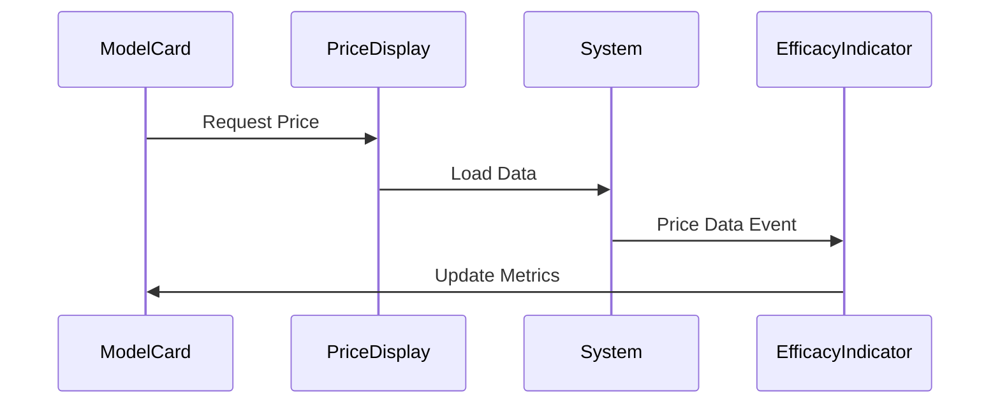

# Model Zone Integration Architecture

This document outlines how the various components in the Model Zone work together to provide a cohesive modeling and analysis experience.

## Component Hierarchy

```
ModelZone
├── NavigationManager
├── ModelCard
│   ├── PriceDisplay
│   └── EfficacyIndicator
├── AnalysisVisualizationIntegration
│   └── AnalysisChart
├── OptimizationEngine
│   └── AnalysisChart
├── SensitivityEngine
│   ├── AnalysisChart
│   └── EfficacyIndicator
└── ImpactAnalysis
    └── AnalysisChart
```

## Component Interactions

### NavigationManager
- Controls the overall navigation flow between different analysis modes
- Maintains breadcrumb navigation state
- Handles keyboard shortcuts and accessibility
- Communicates with parent ModelZone for state updates

### ModelCard
- Serves as the primary interface for model configuration
- Integrates with PriceDisplay for real-time pricing updates
- Connects with EfficacyIndicator for model effectiveness metrics
- Triggers various analysis modes through action buttons
- Maintains inheritance relationships between models

### AnalysisVisualizationIntegration
- Manages the synchronization between analysis state and visualizations
- Handles data transformations and caching
- Provides a unified interface for all visualization components
- Implements debouncing and performance optimizations

### OptimizationEngine
- Runs optimization algorithms for model parameters
- Visualizes optimization results through AnalysisChart
- Maintains optimization state and constraints
- Provides real-time feedback during optimization process

### SensitivityEngine
- Performs sensitivity analysis on model parameters
- Integrates with EfficacyIndicator for impact assessment
- Visualizes sensitivity results through AnalysisChart
- Handles Monte Carlo simulations

### ImpactAnalysis
- Analyzes model changes and their impacts
- Visualizes impact metrics through AnalysisChart
- Provides comparative analysis between models
- Generates impact reports and recommendations

## Data Flow

1. **Model Configuration**
   ```mermaid
   graph LR
   A[ModelCard] --> B[PriceDisplay]
   B --> C[EfficacyIndicator]
   C --> D[State Update]
   D --> A
   ```

2. **Analysis Flow**
   ```mermaid
   graph LR
   A[User Input] --> B[Analysis Engine]
   B --> C[Data Processing]
   C --> D[Visualization]
   D --> E[UI Update]
   ```

3. **Optimization Cycle**
   ```mermaid
   graph LR
   A[Parameters] --> B[Optimization]
   B --> C[Evaluation]
   C --> D[Update]
   D --> A
   ```

## State Management

### Version State
- Managed through VersionStateContext
- Tracks current model version and extensions
- Handles version comparisons and inheritance

### Analysis State
- Maintained in respective analysis engines
- Includes calculation status and results
- Manages caching and performance optimization

### UI State
- Controlled by NavigationManager
- Handles component visibility and transitions
- Manages user interaction states

## Event System

### Custom Events
1. `priceDataLoaded`: Triggered when price data is available
2. `analysisComplete`: Fired when analysis finishes
3. `optimizationUpdate`: Real-time optimization progress
4. `efficacyCalculated`: When efficacy metrics are ready

### Event Flow


## Integration Points

### API Services
- `apiService.js`: Handles all external API calls
- `integrationService.js`: Manages component integration
- `dataProcessing.js`: Common data transformation utilities

### Shared Resources
- CSS Variables
- Utility Functions
- Type Definitions
- Configuration Constants

## Performance Considerations

1. **Data Management**
   - Implement caching for analysis results
   - Use debouncing for real-time updates
   - Optimize data structures for quick access

2. **Rendering Optimization**
   - Lazy load components when needed
   - Use React.memo for pure components
   - Implement virtualization for large datasets

3. **Computation Efficiency**
   - Run heavy calculations in web workers
   - Use batch updates for state changes
   - Implement progressive loading for large models

## Error Handling

1. **Graceful Degradation**
   - Fallback UI for failed components
   - Retry mechanisms for failed operations
   - Clear error messages and recovery options

2. **Error Boundaries**
   - Component-level error catching
   - State recovery mechanisms
   - User feedback systems

## Future Enhancements

1. **Planned Features**
   - Advanced optimization algorithms
   - Machine learning integration
   - Real-time collaboration
   - Extended visualization options

2. **Technical Improvements**
   - Enhanced caching mechanisms
   - Better type safety
   - Improved test coverage
   - Performance monitoring

## Testing Strategy

1. **Unit Tests**
   - Component rendering
   - State management
   - Utility functions
   - Event handling

2. **Integration Tests**
   - Component interactions
   - Data flow
   - API integration
   - Event propagation

3. **End-to-End Tests**
   - User workflows
   - Cross-component functionality
   - Performance benchmarks

## Documentation

1. **Component Documentation**
   - Props and types
   - Usage examples
   - Integration guidelines
   - Performance considerations

2. **API Documentation**
   - Endpoints
   - Data structures
   - Error codes
   - Authentication

3. **Style Guide**
   - Component styling
   - Theme customization
   - Accessibility guidelines
   - Responsive design
